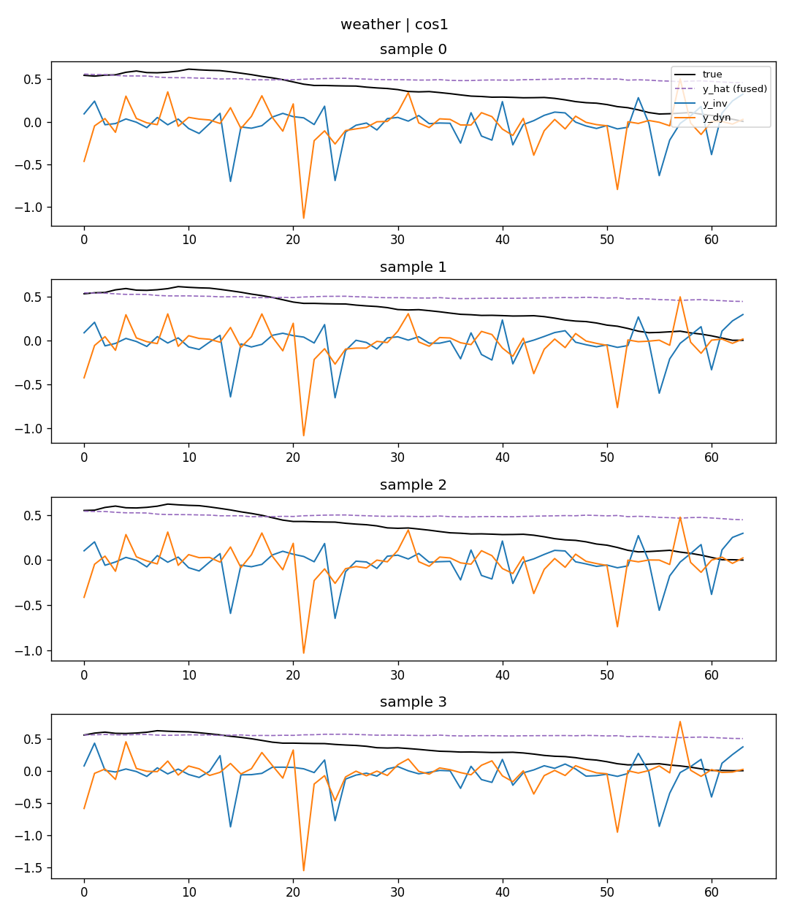
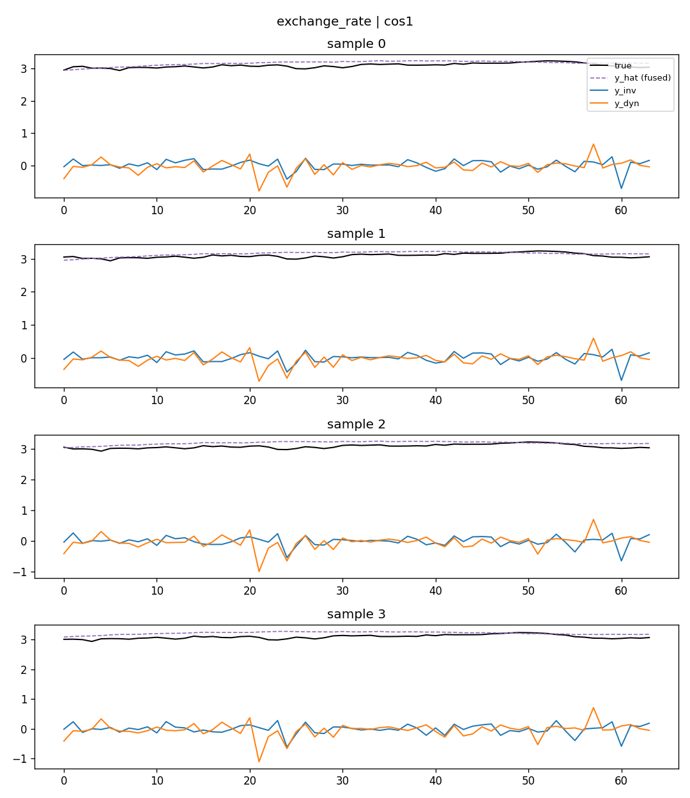

# RIDDE Training Objective ver2.0 — L_cos / L_gbal 消融实验报告

日期:2026-08-13
背景:[RIDDE_ver2.0_xcov消融实验报告.md](RIDDE_ver2.0_xcov消融实验报告.md) 发现 `L_xcov`(批次协方差形式)存在退化解——模型靠让 `gamma` 整体塌缩到接近 0(而不是学习真正的样本内解耦)就能把损失训练到很小,代价是 `y_inv` 分支基本失效(`energy_share_inv` 只有 0.3~0.7%)。该报告提出两个改进方向,本报告分别单独测试,再测合并效果。
- **`L_cos`**:直接惩罚样本内 `cos_sim(z_inv, z_dyn)`,而不是批次协方差
- **`L_gbal`**:惩罚 `gamma` 的整体均值偏离 0.5,防止塌缩

## 0. 实现

`models/ChronosBolt.py`,`idf_ridde_v2` 的 loss 块内(与 `loss_sem/loss_xcov/loss_ord` 平级):

```python
# loss_cos: 样本内 cos_sim(z_inv, z_dyn),该量恒 >= 0(见 xcov 报告第4节推导),无需 abs/平方
cos_sim_sample = F.cosine_similarity(m["z_inv"], m["z_dyn"], dim=-1)  # (B,)
loss_cos = cos_sim_sample.mean()

# loss_gbal: gamma 的全局均值(跨 batch、跨维度)偏离 0.5 的惩罚
loss_gbal = (m["gamma"].mean() - 0.5) ** 2

loss = (loss_forecast + rho_sem*loss_sem + rho_xcov*loss_xcov + rho_ord*loss_ord
        + rho_cos*loss_cos + rho_gbal*loss_gbal)
```

CLI:`--rho_cos`/`--rho_gbal`(`pretrain.py`/`zeroshot.py`),`script/pretrain_idf_ridde_v2.sh`/`script/zeroshot_chronos_idf_ridde_v2.sh` 通过环境变量 `RHO_COS`/`RHO_GBAL` 控制(未占用已有位置参数)。冒烟测试(前向+反向)、100 步预检(单独/合并权重=1)均通过,无 NaN/发散。

实验协议与 sem/xcov 阶段完全一致:`train_steps=10000`,6 数据集(ETTh1/ETTh2/ETTm1/ETTm2/weather/exchange_rate),单种子(2021)三点扫描 `{0.01, 0.1, 1}`,每组训练完立刻做 6 数据集 zeroshot + 诊断。baseline 沿用之前的 `rho_sem=rho_xcov=rho_ord=rho_cos=rho_gbal=0` 结果。

## 1. L_cos 单独测试:效果很好,是目前最健康的正则项

### 1.1 数值结果

| rho_cos | ETTh1 | ETTh2 | ETTm1 | ETTm2 | weather | exchange | **6数据集平均** |
|---|---|---|---|---|---|---|---|
| 0(baseline) | 0.3517 | 0.2366 | 0.2933 | 0.1476 | 0.1479 | 0.0808 | — |
| 0.01 | +0.3% | +1.3% | +0.1% | -0.1% | +0.0% | -3.3% | **-0.28%** |
| 0.1 | +0.2% | +1.6% | +0.4% | +0.0% | +0.1% | -4.6% | **-0.37%** |
| 1.0 | +0.1% | +0.6% | +0.1% | -0.4% | -0.7% | **-8.5%** | **-1.46%** |

模式跟 xcov 很像(exchange_rate 随权重增大持续改善,其余数据集基本中性),但**没有出现任何不稳定迹象**,权重=1 时 ETTh1/ETTm1 几乎不受影响(不像 xcov 那样有轻微负面拖累)。

### 1.2 诊断结果——这次是真解耦,不是退化解

| rho_cos | gamma 均值 | gamma 饱和比例 | \|cos_sim\| | energy_share_inv |
|---|---|---|---|---|
| baseline | 0.516 | 77.2% | 0.112 | 0.453 |
| 0.01 | 0.521 | 81.1% | 0.093 | 0.459 |
| 0.1 | 0.495 | 92.9% | 0.026 | 0.450 |
| 1.0 | **0.491** | 98.9% | **0.0007** | **0.462** |

对比 xcov 报告的对应数字(xcov=1:gamma 均值 0.008、energy_share_inv 0.3~0.7%),这次的结果**质变了**:

- **cos_sim 被真正压到接近 0**(0.0007,比 xcov 的 0.195 好两个数量级),而且是**单调**下降的——权重越大,orthogonality 越强,符合预期,不像 xcov 那样"越饱和 cos_sim 反而越高"的反直觉现象。
- **gamma 均值全程保持在 0.49~0.52**,不像 xcov 那样塌缩到 0.008~0.02。也就是说,gamma 依然保持"分裂成两极"的模式(饱和比例从 77%→99%),但是**双峰分裂**(一半维度归 `z_inv`,一半归 `z_dyn`),不是"整体倒向一边"。
- **`energy_share_inv` 全程稳定在 0.45~0.46**,`y_inv` 分支没有被关闭,两支携带的信息量基本相当。

**这正是我们在 xcov 报告第 4 节推导的机制**:双峰饱和(每个维度硬性分配给某一支)才会真正压低 cos_sim,而且不会破坏 energy_share——`L_cos` 直接惩罚的是这个"样本内点积"量,模型没有捷径可走,只能老老实实把每个维度都学成"要么明确属于 inv,要么明确属于 dyn",这正是论文架构设计想要的路由行为。

### 1.3 可视化——两支都有内容,但都不平滑

以 weather、exchange_rate 为例(其余见 `TS-RAG/results/ridde_v2_diagnostics_plots/*_cos*.png`):

**cos=1,weather:**



**cos=1,exchange_rate:**



跟 xcov 不同,这里 `y_inv`(蓝)不再是一条死板的直线,两支都在正常震荡、幅度接近——证实了 `energy_share_inv≈0.46` 的诊断结果,两支都在被使用。**但这也意味着 `L_cos` 没有解决监测项①("一支平稳一支震荡")**——`L_cos` 只作用于潜空间 `z_inv/z_dyn` 的方向关系,不直接约束 `y_inv/y_dyn` 输出曲线的平滑度,所以两支输出仍然一样"毛躁"。粗糙度差(`R(y_dyn)-R(y_inv)`)在 cos=1 时五个数据集为正(0.06~0.42,量级健康,不像 xcov 的 5~7 那样是退化的极端值),只有 ETTh1 轻微为负(-0.02)——方向基本对,但没有形成视觉上能看出来的"平稳 vs 震荡"分离。

**小结:`L_cos` 解决了监测项②(正交性,而且是真解耦不是钻空子),没有解决监测项①(平稳/震荡)。这与 `L_ord`(专门约束粗糙度)的分工是互补的,不是替代关系。**

## 2. L_gbal 单独测试:符合预期地"无效"——因为 baseline 本来就没有 gamma 塌缩问题

### 2.1 数值结果

| rho_gbal | ETTh1 | ETTh2 | ETTm1 | ETTm2 | weather | exchange | **6数据集平均** |
|---|---|---|---|---|---|---|---|
| 0(baseline) | 0.3517 | 0.2366 | 0.2933 | 0.1476 | 0.1479 | 0.0808 | — |
| 0.01 | +0.1% | +1.5% | -0.6% | -0.3% | -0.1% | -2.1% | **-0.24%** |
| 0.1 | +0.1% | +0.8% | +0.0% | +0.1% | +0.6% | +5.3% | **+1.15%** |
| 1.0 | +0.1% | +0.8% | +0.0% | +0.7% | +0.3% | -1.4% | **+0.10%** |

三个权重下 MSE 变化都很小、方向不一致(exchange_rate 甚至 -2.1%→+5.3%→-1.4% 来回摆),看不出跟权重相关的单调趋势,基本是噪声水平。

### 2.2 诊断结果——gamma 本来就没塌缩,所以这个正则项无事可做

| rho_gbal | gamma 均值 | gamma 饱和比例 | \|cos_sim\| | energy_share_inv |
|---|---|---|---|---|
| baseline | 0.516 | 77.2% | 0.112 | 0.453 |
| 0.01 | 0.517 | 77.3% | 0.118 | 0.438 |
| 0.1 | 0.510 | 73.8% | 0.128 | 0.460 |
| 1.0 | 0.492 | 78.3% | 0.111 | 0.439 |

四行数字几乎是同一组数(gamma 均值全部在 0.49~0.52,饱和比例全部在 74~78%,cos_sim 全部在 0.11~0.13,energy_share 全部在 0.44~0.46),权重从 0.01 加到 1 没有产生任何单调、可辨识的变化。

**原因很直接**:`L_gbal = (gamma.mean() - 0.5)²` 惩罚的是"gamma 的全局均值偏离 0.5",而 **baseline 的 gamma 均值本来就是 0.516,已经非常接近 0.5**——这个 loss 项在 baseline 上从一开始就接近 0(`(0.516-0.5)²≈0.00026`),没有什么可优化的空间,加大权重也没用。

这跟 xcov 报告里发现的问题对上了:gamma 塌缩(均值掉到 0.008~0.02)是 **`L_xcov` 主动驱动出来的副作用**,不是模型的默认行为。`L_gbal` 单独使用时没有"敌人"可以对抗,自然测不出效果——它的设计目的本来就是**防御性的**,只有在跟会导致塌缩的正则项(比如 `L_xcov`)一起用时才有意义。单独测试的这个"无效"结果本身是符合预期、可以解释的,不是坏消息。

## 3. 合并测试:cos=1 + gbal=1——gbal 不仅没加分,还拖累了 cos 的收益

### 3.1 数值结果

| | ETTh1 | ETTh2 | ETTm1 | ETTm2 | weather | exchange | **6数据集平均** |
|---|---|---|---|---|---|---|---|
| cos=1(单独) | +0.1% | +0.6% | +0.1% | -0.4% | -0.7% | **-8.5%** | **-1.46%** |
| cos=1 + gbal=1 | -0.0% | -0.3% | +0.1% | +0.2% | +0.3% | **-0.7%** | **-0.08%** |

加了 `gbal=1` 之后,`cos=1` 原本在 exchange_rate 上的 -8.5% 提升几乎完全消失(只剩 -0.7%),6 数据集平均提升也从 -1.46% 缩水到 -0.08%(基本回到噪声水平)。

### 3.2 诊断结果——架构层面看不出差异,问题出在别处

| | gamma 均值 | gamma 饱和比例 | \|cos_sim\| | energy_share_inv |
|---|---|---|---|---|
| cos=1(单独) | 0.491 | 98.9% | 0.0007 | 0.462 |
| cos=1 + gbal=1 | 0.496 | 98.6% | 0.0011 | 0.464 |

**四个诊断指标几乎完全一样**——这印证了第 2 节的判断:`gbal` 在这个场景下确实没有改变模型学到的表示结构(gamma 分布、正交性、能量分配都跟单独用 cos 时几乎相同)。也就是说,`gbal` 拖累准确率**不是因为它改变了 gamma/cos_sim 这些我们在监测的量**,而更可能是一个纯优化层面的副作用:`gbal` 的梯度信号(哪怕很小,`(gamma.mean()-0.5)²` 在 gamma 已经接近 0.5 时梯度幅度很小)在跟 `L_cos` 共同训练时,还是对参数更新方向产生了轻微干扰,而这个干扰没有带来任何补偿性收益(因为本来就没有塌缩问题要修)。

### 3.3 结论

**不建议合并使用 `L_cos` + `L_gbal`。** `L_gbal` 只在"确实存在 gamma 塌缩风险"的场景下才有存在的价值(比如配合 `L_xcov` 使用,尽管这个组合本报告没有测试,是一个自然的后续方向);单独用 `L_cos` 就已经同时解决了正交性问题、没有塌缩问题,画蛇添足加上 `L_gbal` 反而在这次实验里让原本干净的收益打了折扣。

## 4. 总结与建议

1. **`L_cos`(单独使用)是本轮所有正则项消融里综合表现最好的一个**:MSE 平均 -1.46%(exchange_rate -8.5%,其余数据集中性到略有改善),同时是唯一一个"数值变好"和"架构诊断健康"两者兼得的正则项——cos_sim 真正降到接近 0,gamma 保持双峰饱和但不塌缩(均值稳定在 0.49 左右),`energy_share_inv` 稳定在 45~46%(两支都在被使用,不是退化解)。
2. **`L_gbal`(单独使用)符合预期地"无效"**:baseline 的 gamma 均值本来就接近 0.5,这个正则项没有可以纠正的问题,权重加到 1 都测不出方向一致的效果。这不是坏结果,只是说明它是一个防御性工具,需要配合真正会导致塌缩的正则项(如 `L_xcov`)才有意义——本报告没有测试 `xcov+gbal` 这个组合,如果还想验证"gbal 到底能不能防住 xcov 的塌缩",这是下一步可以做的实验。
3. **`L_cos` + `L_gbal` 合并使用效果反而更差**:诊断指标跟单独用 cos 几乎一样,但 MSE 提升缩水了近 20 倍(-1.46%→-0.08%),说明这次的"合并"是负收益,不建议采用。
4. **仍未解决的问题**:三个正则项(sem/xcov/cos/gbal 到目前为止测过的全部)都没能实现"y_inv 平稳、y_dyn 震荡"这个监测项①的目标(xcov 的"平稳"是退化解,cos 干脆没在管这件事)。如果这个目标本身仍然重要,大概率需要引入类似 `L_ord`(专门约束粗糙度,阶段4 待测)的机制,并且这次的证据支持"跟 cos 搭配"而不是"跟 xcov 搭配",因为 cos 已经证明能在不破坏分支能量的前提下做到真正解耦。

## 附录:数据位置

- `L_cos`:`TS-RAG/results/ridde_v2_ablation_logs/summary_cos.txt`,图 `TS-RAG/results/ridde_v2_diagnostics_plots/*_cos*.png`
- `L_gbal`:`TS-RAG/results/ridde_v2_ablation_logs/summary_gbal.txt`,图 `TS-RAG/results/ridde_v2_diagnostics_plots/*_gbal*.png`
- 合并测试:`TS-RAG/results/ridde_v2_ablation_logs/summary_cos_gbal_combined.txt`,图 `TS-RAG/results/ridde_v2_diagnostics_plots/*_cos1_gbal1*.png`
