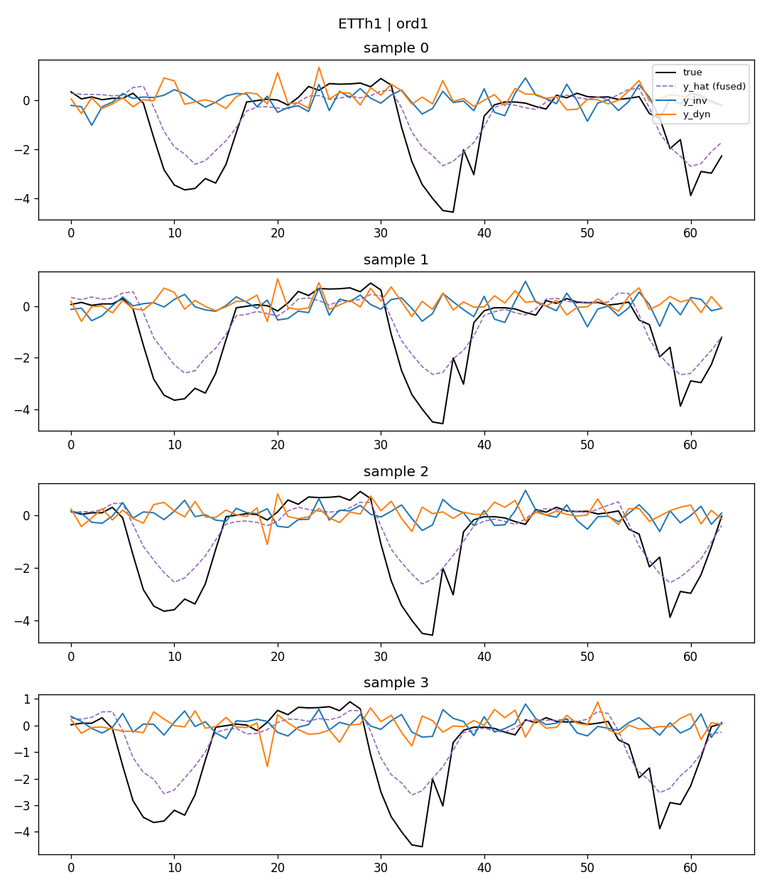

# RIDDE Training Objective ver2.0 — L_ord 消融实验报告(v2,含论文核对与小权重补测)

日期:2026-08-14~2026-08-15
范围:`idf_ridde_v2`(ChronosBoltRetrieve)阶段4,单独测 `L_ord`(`rho_sem=rho_xcov=rho_cos=rho_gbal=0`),协议与 sem/xcov/cos 完全一致。
**本版相对初版的改动**:重新核对了 `nips_2026_TS.pdf` 原文,发现论文明确要求 `L_ord` 用"相对其他项更小的权重",而初版只测了 `{0.01, 0.1, 1}`(跟 sem/xcov 同一个尺度),可能一直测在偏大的区间。本版补测了 `{0.0001, 0.001, 0.01}`,并重新梳理了结论。

## 0. 背景、公式与论文核对

`L_ord`(论文 Eq.22-23)是三个正则项里唯一直接约束"输出曲线形状"的一项:

```python
def _roughness(y):  # y: (B, Q, L)
    d2 = y[..., 2:] - 2 * y[..., 1:-1] + y[..., :-2]
    return torch.log(d2.var(dim=-1) + 1e-8)

R_inv = roughness(y_inv).mean(dim=1)
R_dyn = roughness(y_dyn).mean(dim=1)
loss_ord = (c_i * torch.clamp(R_inv - R_dyn + ord_margin, min=0.0)).mean()
```

对照论文原文逐项核对:
- Eq.22 `L_ord = (1/M) Σ c_i · max(0, R(ŷ^inv_i) - R(ŷ^dyn_i) + m)` —— 跟代码逐项对得上。
- Eq.23 `R(ŷ) = log(Var(Δ²ŷ) + ε)` —— 跟代码逐项对得上。
- **论文原文第 240-241 行明确写道**:"Because smoothness is an empirically motivated inductive bias rather than a strict definitional property of the invariant branch, **L_ord is assigned a small weight λ_ord relative to the other terms**"——论文自己强调这一项该配一个"相对更小"的权重。**初版报告测的 `rho_ord ∈ {0.01, 0.1, 1}` 跟 sem/xcov 用了同一套尺度,没有遵守这条设计说明**,这是本次补测和重写的直接原因。

`L_ord` 跟 `L_sem` 一样用 `c_i` 做样本加权,已确认 `c_i` 在 ETTh2/ETTm2/exchange_rate 上均值几乎精确为 0。

## 1. 数值结果:全量扫描(0.0001 ~ 1)

| rho_ord | ETTh1 | ETTh2 | ETTm1 | ETTm2 | weather | exchange | **6数据集平均** |
|---|---|---|---|---|---|---|---|
| 0(baseline) | 0.3517 | 0.2366 | 0.2933 | 0.1476 | 0.1479 | 0.0808 | — |
| **0.0001** | +0.5% | +1.6% | -0.3% | -0.1% | -0.1% | **-5.7%** | **-0.67%** |
| **0.001** | +0.0% | -0.3% | +0.0% | +1.1% | +1.1% | **+16.1%** | **+3.01%** |
| 0.01 | +0.6% | +0.7% | +0.8% | +1.4% | +1.3% | +12.5% | **+2.88%** |
| 0.1 | +0.1% | +0.5% | +0.4% | +0.5% | +0.6% | +6.4% | **+1.42%** |
| 1.0 | +0.6% | +1.8% | +1.5% | +1.4% | +1.2% | +5.1% | **+1.94%** |

**新增的三个小权重点没有呈现"权重越小、效果越干净"的单调关系**——`0.0001` 是所有测过的点里唯一一个平均变好的(-0.67%,exchange_rate -5.7%),但紧邻它的 `0.001` 反而是最差的点之一(+3.01%,exchange_rate 单点 +16.1%,比 `0.01`/`1.0` 都差)。三个小权重点之间没有平滑过渡,`0.0001→0.001→0.01` 是"变好→暴涨→回落"而不是一条趋势线。

## 2. 监测项②③:诊断结果——小权重下确实避开了"能量塌缩",但 MSE 信号本身很不稳定

**指标说明**:
- **`energy_share_inv`**`= Var(y_inv) / (Var(y_inv) + Var(y_dyn))`,不变分支的输出方差占两支总方差的比例。接近 50% 说明两支贡献的信息量相当;塌缩到接近 0%(或另一极端接近 100%)说明其中一支已经不携带有效信息,是判断分解是否"退化"的最直接指标(详见 xcov/cos_gbal 报告的推导)。
- **`cos_sim`** 即 `|cos_sim(z_inv, z_dyn)|`(监测项②),衡量潜空间里两支表示的方向是否重合。sem 报告已推导过:因为 `z_inv=γ·h, z_dyn=(1-γ)·h`,这个量恒 ≥0,且更多是 gamma 饱和模式的副产品,不是独立的解耦证据(参考 sem 报告第4节、xcov 报告第4节)。

| rho_ord | gamma 均值 | cos_sim(监测项②) | 粗糙度差 R(y_dyn)-R(y_inv) | energy_share_inv(监测项③) |
|---|---|---|---|---|
| baseline | 0.516 | 0.112 | 0.249 | 0.453 |
| **0.0001** | 0.520 | 0.109 | 0.301 | 0.443 |
| **0.001** | 0.522 | 0.106 | 0.200 | 0.465 |
| 0.01 | 0.511 | 0.115 | 0.302 | 0.444 |
| 0.1 | 0.488 | 0.126 | 0.619 | 0.385 |
| 1.0 | **0.393** | 0.126 | **0.756** | **0.351** |

**监测项②(cos_sim)在 `L_ord` 这里基本没有存在感**:全程在 0.11~0.13 之间小幅波动,既不像 `L_cos` 那样被主动压低,也不像 `L_xcov` 那样出现异常升高,权重从 0.0001 加到 1 几乎看不出趋势——这符合预期,因为 `L_ord` 的公式压根不涉及 `z_inv`/`z_dyn` 的方向关系,只约束 `y_inv`/`y_dyn` 输出的粗糙度,cos_sim 的这点小波动更可能是 gamma 均值本身小幅漂移(0.52→0.39)带来的间接副作用,不是 `L_ord` 直接作用的结果。

监测项③(gamma/energy_share)是这份报告的核心发现,好消息:**`rho_ord ≤ 0.01` 时,gamma 均值(0.51~0.52)和 `energy_share_inv`(0.44~0.47)都跟 baseline 基本持平,没有出现 0.1/1 那种随权重单调塌缩的现象**——论文"配小权重"这条建议在防止退化解这件事上是对的,小权重确实基本避开了压低 `y_inv` 能量这条捷径。

但坏消息更值得注意:**在这个"机制健康"的小权重区间里(0.0001/0.001/0.01 三点,gamma/energy 几乎是同一组数),MSE 却分别是 -0.67%、+3.01%、+2.88%——诊断指标看不出实质差异,MSE 却上蹿下跳。** 这跟我们在 `L_sem` 阶段确认过的教训一致:exchange_rate 单种子波动能到原值的 10% 以上(前面种子校验测得 std 最高到 0.008,相当于均值的 8%~10%),而这里 `0.0001→0.001` 的 exchange_rate 从 0.0762 跳到 0.0938,涨幅 23%,已经明显超出机制本身能解释的范围,**大概率主要是单种子噪声,不是"权重从 0.0001 加到 0.001 真的让模型变差了 3 倍"这么大的真实效应**。

**结论:小权重区间(≤0.01)下,`L_ord` 至少不会像 0.1/1 那样确定性地压塌 `y_inv` 的能量,但也没有证据表明它带来了可信的正向收益——`0.0001` 那个"变好"的结果,在没有补种子验证之前,不能当作定论(参考 `L_sem` 报告里 exchange_rate 曾经"看起来变好、种子校验后消失"的先例)。**

### 2.1 三种子方差校验——证实了上面的怀疑:小权重区间没有正向效果,而是小幅、一致的负面效果

给 `{0.0001, 0.001, 0.01}` 各补了 2 个种子(42, 123,baseline 复用已有的种子结果),结果彻底否定了单种子看到的"0.0001 变好":

| | ETTh1 | ETTh2 | ETTm1 | ETTm2 | weather | exchange | **6数据集平均** |
|---|---|---|---|---|---|---|---|
| ord=0.0001(3种子) | +0.5% | +0.2% | +0.7% | +0.5% | +0.2% | +2.5% | **+0.75%** |
| ord=0.001(3种子) | +0.1% | +0.4% | +0.2% | +0.1% | +0.2% | +3.7% | **+0.78%** |
| ord=0.01(3种子) | +0.4% | +0.3% | +0.8% | +0.5% | +0.3% | +1.6% | **+0.64%** |

exchange_rate 的种子间标准差在这三个权重下分别是 0.0051/0.0082/0.0071(相当于均值的 6%~10%),证实了之前单种子看到的"0.0001 变好 -5.7%"和"0.001 暴涨 +16.1%"确实都是噪声——三种子平均后,exchange_rate 在三个权重下其实都是变差的(+2.5%/+3.7%/+1.6%),没有一个变好。

其余 5 个数据集单独看,大部分变化量级(+0.0001~+0.0023)跟种子间标准差(+0.0004~+0.002)接近,单个数据集层面大多算不上"显著超出噪声"。但**六个数据集在三个权重下,没有一次出现负号(变好)**——18 个"数据集×权重"组合全部是非负,这个"一致偏一个方向"的模式本身不太可能是纯随机噪声(纯噪声应该有正有负、大致对半),更像是一个真实存在、但幅度很小(平均 +0.64%~+0.78%)的负面效应。

**修正结论:小权重区间(0.0001~0.01)不是"没有效果",而是"小幅但一致地变差"——三个权重的平均伤害程度几乎相同(+0.64%~+0.78%),没有随权重降低而减弱的趋势,论文建议的"配小权重"确实避免了 0.1/1 那种能量塌缩式的重度伤害,但换来的不是中性或正向,而是一个更温和、更难被单个数据集单独证实、但方向一致的轻微负面效果。**

## 3. rho_ord ≥ 0.1:确定性的退化解(这部分结论不变)

权重升到 0.1/1 之后,能量塌缩变得确定、单调、可重复(gamma 0.488→0.393,energy 0.385→0.351,MSE 全数据集稳定变差),不再是噪声能解释的量级。**这部分是本次探索里少有的、不需要补种子就能确认的负面结论**:一旦权重跨过某个阈值(大致在 0.01~0.1 之间),`L_ord` 就会稳定地走上"压低 y_inv 方差来降粗糙度"这条捷径。

达成"粗糙度差"这个字面目标的方式跟 `L_xcov` 是同一类退化解:让 `y_inv` 变"平滑"最省力的办法不是学出一个有意义的低频/趋势分量,而是直接压低 `y_inv` 的方差——方差越小,`log(Var+eps)` 就越负,"粗糙度"这个指标就越小,不需要 `y_inv` 里真的携带什么有用信息。

## 4. 监测项①:可视化——不管权重大小,肉眼都看不出干净的"一平一糙"

**ord=1,ETTh1:**



`y_inv`/`y_dyn`(蓝/橙)在视觉上仍然是同一量级的锯齿,没有形成"一支是平滑趋势线、一支是噪声"的清晰分离;这张图还暴露了另一个问题——真实值(黑线)几次深达 -4 的下探,融合预测(紫色虚线)明显跟不上,这跟 ETTh1 在 ord 权重下 MSE 持续变差直接对应。小权重(0.0001/0.001)的图形态和这张接近,不再单独贴出。

## 5. c_i 的角色:诊断时样本级权重虽低,但训练时机制依然生效

跟初版一致:诊断阶段测得的 `c_i` 分布不随 `rho_ord` 变化(ETTh2/ETTm2/exchange_rate 均值≈0,ETTh1≈0.015~0.017,ETTm1≈0.12~0.13,weather≈0.003)。粗糙度差在 `rho_ord≥0.1` 时依然被显著拉开,说明诊断时某个 eval 数据集上 `c_i` 接近 0 不等于训练时这个正则项完全没有梯度信号——预训练用的是混合语料,训练过程中大概率存在足够多 `c_i` 不那么小的样本/批次,把约束"烙"进了共享权重里。

## 6. 合并测试:cos=1 + ord=1

| | ETTh1 | ETTh2 | ETTm1 | ETTm2 | weather | exchange | **6数据集平均** |
|---|---|---|---|---|---|---|---|
| ord=1(单独) | +0.6% | +1.8% | +1.5% | +1.4% | +1.2% | +5.1% | **+1.94%** |
| cos=1(单独) | +0.1% | +0.6% | +0.1% | -0.4% | -0.7% | -8.5% | **-1.46%** |
| cos=1 + ord=1 | +0.6% | +0.0% | +0.4% | +0.1% | -0.1% | +1.1% | **+0.35%** |

| | gamma 均值 | cos_sim(监测项②) | 粗糙度差 | energy_share_inv(监测项③) |
|---|---|---|---|---|
| baseline | 0.516 | 0.112 | 0.249 | 0.453 |
| ord=1(单独) | 0.393 | 0.126 | 0.756 | 0.351 |
| cos=1(单独) | 0.491 | 0.0007 | 0.222 | 0.462 |
| cos=1 + ord=1 | **0.451** | **0.0005** | **0.466** | **0.424** |

合并后 cos_sim 依然被压到接近 0(0.0005,和 cos=1 单独使用时的 0.0007 基本一致)——说明 `L_cos` 主导的正交化效果没有被 `L_ord` 干扰,监测项②在这个组合里依然是"健康"的,问题集中在监测项③(energy_share 只恢复到 0.424,没有回到 cos=1 单独的 0.462)。

`L_cos` 先把 `z_inv`/`z_dyn` 解耦干净之后,`L_ord=1` 造成的能量塌缩被明显缓解(gamma 0.393→0.451,energy 0.351→0.424),MSE 从全面变差的 +1.94% 降到接近中性的 +0.35%,但没有完全恢复到 cos 单独使用时的健康水平,也没能保住 cos 单独的 -1.46% 收益。可视化上(见 `ETTh1_cos1_ord1.png`)粗糙度差数值提升了(0.84,换算成方差比约 2.3 倍),但依然是统计量级的差异,肉眼分不出"一平一糙"。这部分结论跟初版一致,不受本次小权重补测影响(因为组合测试用的是 `ord=1`,不在本次重新核对权重尺度的范围内)。

## 7. 结论汇总(v2,含种子校验后的最终结论)

1. **论文明确要求 `L_ord` 配小权重,这条设计说明在"避免重度退化解"这件事上是对的**:`rho_ord ≤ 0.01` 时,gamma/energy_share 基本不塌缩(接近 baseline 水平);`rho_ord ≥ 0.1` 后确定性地走上"压低 y_inv 能量"这条退化解捷径,且随权重单调恶化。**权重阈值大致在 0.01~0.1 之间。**
2. **但小权重区间也不是"无害"或"无效",而是经 3 种子校验确认的、小幅但一致的负面效果**:`{0.0001, 0.001, 0.01}` 三个权重的 3 种子平均 MSE 变化分别是 +0.75%/+0.78%/+0.64%,彼此之间没有随权重变化的趋势(基本是同一个量级),且 18 个"数据集×权重"组合里没有一次出现变好——之前单种子看到的"0.0001 变好 -0.67%""0.001 暴涨 +3.01%"都被证实主要是 exchange_rate 的单种子噪声(该数据集种子间标准差可达均值的 6%~10%)。**结论:`L_ord` 在论文建议的小权重区间内,没有证据支持它有正向效果,反而有小幅但方向一致的负面效果**,不像 `L_sem` 安全区间那样"基本测不出方向"。
3. **`rho_ord ≥ 0.1` 时的负面结论依然是最可靠、幅度最大的**,不需要种子校验——效应量级远超单种子噪声能解释的范围,且机制(能量塌缩)有清晰、单调、可重复的诊断证据支撑。
4. **`L_cos + L_ord` 组合能部分缓解 `ord=1` 的重度退化解**,把确定性负面效果压到接近中性,但代价是吃掉 `L_cos` 单独使用的收益,粗糙度分离依然停留在统计显著、肉眼不可辨的水平。
5. **综合看,`L_ord`(原论文公式)在本次测试的全部权重范围(0.0001~1)内都没有找到能带来正向收益的配置**——小权重时是"小幅但一致地变差",大权重时是"确定性的重度退化解"。

## 附录:数据位置

- 主权重(0.01/0.1/1)单独测试:`TS-RAG/results/ridde_v2_ablation_logs/summary_ord.txt`,图 `TS-RAG/results/ridde_v2_diagnostics_plots/*_ord[01].*.png` 与 `*_ord1.png`
- 小权重(0.0001/0.001/0.01)单种子补测:`TS-RAG/results/ridde_v2_ablation_logs/summary_ord_smallweight.txt`,图 `TS-RAG/results/ridde_v2_diagnostics_plots/*_ordsmall*.png`
- 小权重 3 种子校验:`TS-RAG/results/ridde_v2_ablation_logs/summary_ord_smallweight_seeds.txt`
- 合并测试(cos=1+ord=1):`TS-RAG/results/ridde_v2_ablation_logs/summary_cos_ord_combined.txt`,图 `TS-RAG/results/ridde_v2_diagnostics_plots/*_cos1_ord1*.png`
