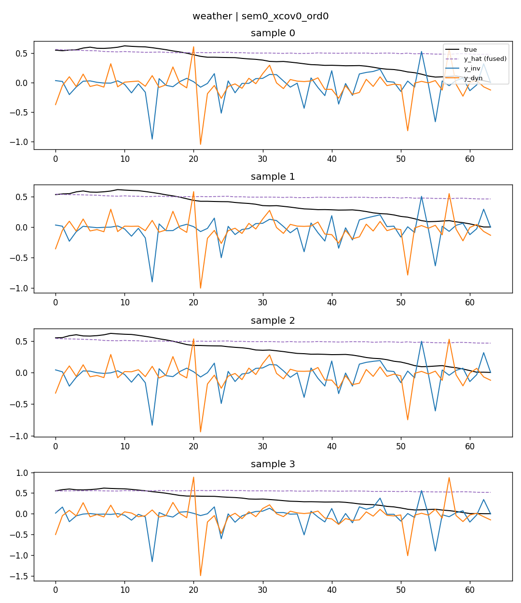
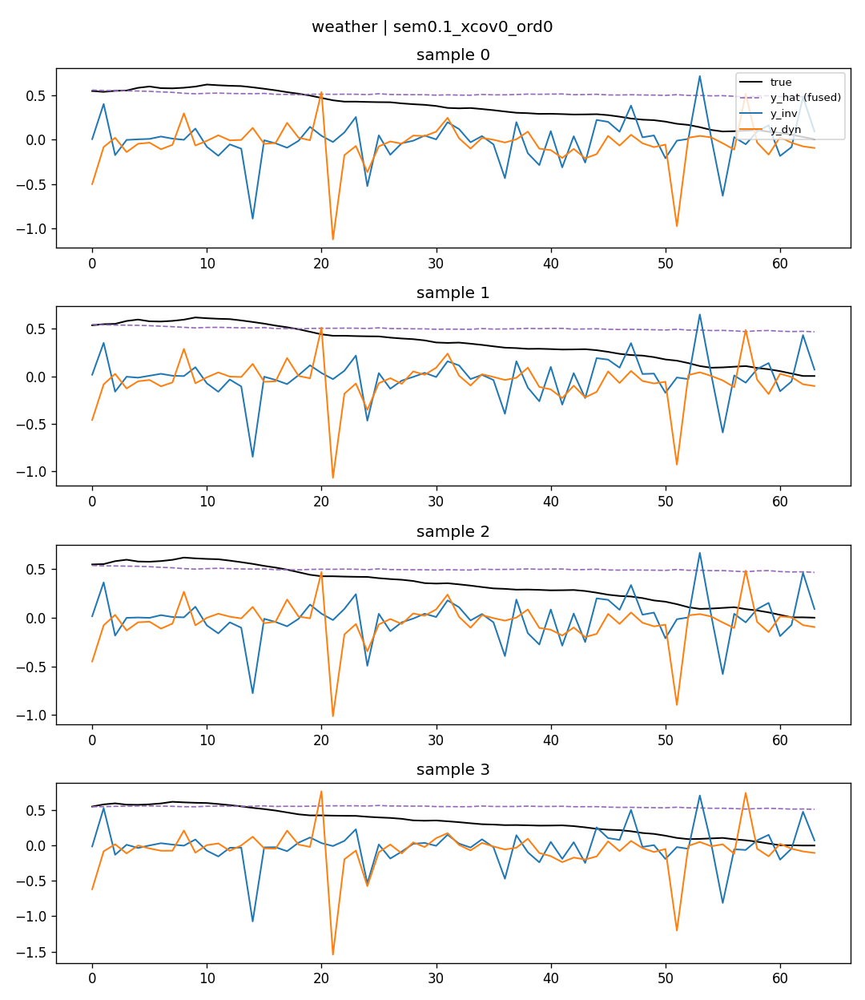
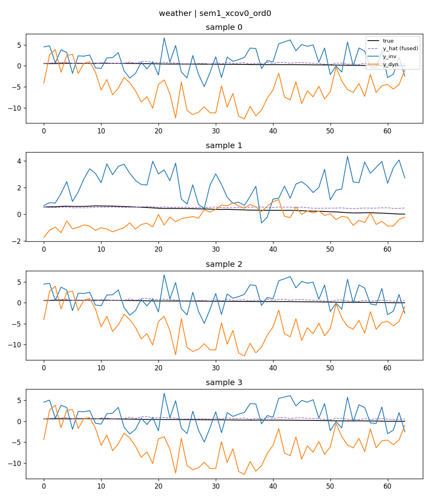

# RIDDE Training Objective ver2.0 — L_sem 消融实验报告

日期:2026-08-12
范围:`idf_ridde_v2`(ChronosBoltRetrieve)阶段2,只开 `L_sem`,`L_xcov`/`L_ord` 保持为 0
参考:`RIDDE_正则项消融实验清单.md`(阶段2 监测项 1/2/3)

## 1. 实验设置

- 模型:`augment_mode=idf_ridde_v2`,backbone 冻结(`--freeze_chronos_bolt`),只训练检索融合头(`encode_mlp / ret_score_head / fuse_gate / routing_gate / inv_pred_head / dyn_pred_head_clean / final_pred_head`)
- 训练:`train_steps=10000`,`batch_size=256`,`lr=3e-4`,预训练数据 `pretrain_pairs_ctx512`,`top_k=10`
- baseline = `idf_ridde_v2` 且 `rho_sem=rho_xcov=rho_ord=0`(架构跟加了正则的版本完全一致,只是三个正则权重都是 0,等价于纯 `L_pred`,用作公平对照)
- 评估:zeroshot,`context=512, pred=64`,6 个数据集 ETTh1 / ETTh2 / ETTm1 / ETTm2 / weather / exchange_rate
- 扫描点:`rho_sem ∈ {0, 0.01, 0.1, 0.2, 0.3, 0.5, 0.7, 1}`,单种子(2021);对 `{0, 0.01, 0.1}` 额外补了 2 个种子(42, 123)做方差校验
- 原始数据:`TS-RAG/results/ridde_v2_ablation_logs/`(训练/评估 log)、`TS-RAG/results/ridde_v2_diagnostics_npz/`(逐样本诊断数组)、`TS-RAG/results/ridde_v2_diagnostics_plots/`(y_inv/y_dyn 可视化图)

## 2. 主要结果:MSE 随 rho_sem 的变化

### 2.1 单种子全量扫描(相对 baseline 的 MSE 变化 %)

| rho_sem | ETTh1 | ETTh2 | ETTm1 | ETTm2 | weather | exchange | **6数据集平均** |
|---|---|---|---|---|---|---|---|
| 0(baseline) | 0.3517 | 0.2366 | 0.2933 | 0.1476 | 0.1479 | 0.0808 | — |
| 0.01 | +0.6% | +1.4% | +0.0% | -0.1% | -0.3% | -3.6% | **-0.3%** |
| 0.1 | +1.1% | +0.8% | +0.6% | -0.5% | -0.1% | -3.6% | **-0.3%** |
| 0.2 | +0.3% | +1.1% | +0.4% | +0.5% | +0.2% | +1.0% | **+0.6%** |
| 0.3 | +0.9% | +1.7% | +0.6% | -0.3% | +0.7% | +2.6% | **+1.0%** |
| 0.5 | +4.2% | +8.5% | **+74.7%** | +15.7% | +12.7% | +25.0% | **+23.5%** |
| 0.7 | +5.3% | +10.9% | **+146.1%** | +28.0% | +20.8% | +29.8% | **+40.2%** |
| 1.0 | +4.4% | +9.9% | +102.6% | +27.2% | +33.6% | +34.0% | **+35.3%** |

**断崖点在 0.3 → 0.5 之间。** `rho_sem ≤ 0.3` 时模型稳定,平均变化在 -0.3%~+1.0% 之间;超过 0.5 后直接跳变到 +23.5%(ETTm1 单点 +74.7%),0.7 是最差点(ETTm1 +146%),1.0 相比 0.7 略"缓和"(更像不稳定区间的震荡,不是真正变好)。

### 2.2 三种子方差校验(mean±std,MSE)

| 数据集 | baseline | sem=0.01 | sem=0.1 | Δ(0.01) vs 噪声 | Δ(0.1) vs 噪声 |
|---|---|---|---|---|---|
| ETTh1 | 0.3516±0.0005 | 0.3531±0.0007 | 0.3532±0.0015 | Δ=+0.0015,**超出噪声**(小幅变差) | Δ=+0.0016,与噪声相当 |
| ETTh2 | 0.2378±0.0013 | 0.2383±0.0013 | 0.2380±0.0006 | Δ=+0.0005,在噪声内 | Δ=+0.0001,在噪声内 |
| ETTm1 | 0.2918±0.0011 | 0.2929±0.0003 | 0.2944±0.0009 | Δ=+0.0012,边界 | Δ=+0.0026,**超出噪声**(小幅变差) |
| ETTm2 | 0.1480±0.0004 | 0.1483±0.0009 | 0.1481±0.0009 | Δ=+0.0003,在噪声内 | Δ=+0.0002,在噪声内 |
| weather | 0.1482±0.0002 | 0.1483±0.0007 | 0.1484±0.0006 | Δ=+0.0001,在噪声内 | Δ=+0.0002,在噪声内 |
| exchange_rate | 0.0800±0.0008 | 0.0817±0.0032 | 0.0823±0.0032 | Δ=+0.0017,**噪声本身就很大**(std=0.0032),无法判断 | Δ=+0.0023,同上 |

单种子结果里 exchange_rate 曾显示"变好"(-3.6%),补了 2 个种子后均值反而是变差的,且该数据集种子间波动本身很大——之前的"变好"是运气好的种子,不是真实效应。**6 个数据集里没有一个在 3 种子平均下显示出可信的正向提升**;ETTh1、ETTm1 反而在 sem=0.01/0.1 下出现了小幅但超出噪声的负面效应。

## 3. 监测项①:y_inv / y_dyn 可视化——有没有"一支平稳、一支震荡"

用 `ridde_v2_diagnostics.py` 对每个 checkpoint 抓取真实样本的 `y_inv`(不变分支预测)、`y_dyn`(动态分支预测)、`y_hat`(融合输出)曲线,叠加真值画图。以下是 weather 数据集的例子(其余数据集图见 `TS-RAG/results/ridde_v2_diagnostics_plots/`):

**baseline(sem=0)**:



**sem=0.1**(基本和 baseline 长得一样):



**sem=1**(不是平稳/震荡分离,而是整体幅度炸开):



**结论:没有观察到"一支平稳、一支震荡"的分离。**

- baseline 和 sem=0.1 下,`y_inv`(蓝)和 `y_dyn`(橙)视觉上几乎一样——都是锯齿状高频抖动,幅度接近,分不出谁是"不变项"谁是"动态项"。
- 数值上的粗糙度差 `R(y_dyn) - R(y_inv)`(六数据集平均,越正越符合论文期望)在合理权重范围内确实是正的,但幅度很小、且不单调:

  | 配置 | baseline | sem=0.01 | sem=0.1 | sem=1 |
  |---|---|---|---|---|
  | R(y_dyn)-R(y_inv) 平均 | +0.249 | +0.157 | +0.305 | **-0.155** |

  这个正数更像是架构本身(z_inv/z_dyn 来自同一个 h 的互补门控)带来的副产品,不是 L_sem 主动学出来的——因为 L_sem 的公式里根本没有约束粗糙度/平滑度的项。
- sem=1 时,`y_inv`/`y_dyn` 都发生了量级爆炸(纵轴从 ±1 变成 -12~+7),粗糙度差的方向反而**翻转成负**,预测质量同时全面变差。也就是说加大 sem 权重不会让分解更接近论文期望的样子,只是把两支都搞坏了。

## 4. 监测项②:cos_sim(z_inv, z_dyn)

### 4.1 观测数据

| 配置 | \|cos_sim(z_inv,z_dyn)\| 平均(6数据集) |
|---|---|
| baseline | 0.112 |
| sem=0.01 | 0.109 |
| sem=0.1 | 0.114 |
| sem=1 | **0.020** |

baseline(完全没有正则项)时 cos_sim 就已经在 0.11 左右,sem=0.01/0.1 几乎不变;只有 sem=1 才把它压到 0.02,但这是以预测质量崩溃为代价换来的。

### 4.2 架构分析:z_inv/z_dyn 不是天然正交的,而是结构上不可能"反向"

代码里 (`models/ChronosBolt.py:1249-1251`):

```python
gamma = torch.sigmoid(self.routing_gate(route_in))
z_inv = gamma * h
z_dyn = (1 - gamma) * h
```

两者是同一个向量 `h` 按逐维互补权重 `gamma` / `1-gamma` 拆分出来的,不是两个独立算出来的表示。点积:

```
z_inv · z_dyn = Σ_i [γ_i·h_i] · [(1-γ_i)·h_i] = Σ_i γ_i(1-γ_i)·h_i²
```

- 因为 `γ_i(1-γ_i) ≥ 0` 恒成立(γ∈(0,1)),这个点积**永远 ≥ 0**——z_inv 和 z_dyn 在设计上根本不可能负相关,cos_sim 只能落在 `[0,1]`,不可能小于 0。
- 只有当每一维的 `γ_i` **严格等于 0 或 1**(gamma 完全饱和成硬 0/1 掩码)时,对应维度才会精确贡献 0,点积才会真正趋于 0(完全正交)。

也就是说 **cos_sim 低不是"两支学到了独立语义"的证据,而是 gamma 饱和度的副产品**。结合第 5 节的数据看:baseline 的 gamma 饱和度约 77%,对应 cos_sim≈0.11 的残余相关性正好来自那约 23% 没饱和的维度;sem=1 时 gamma 饱和度冲到 94%,cos_sim 同步跌到 0.02——这是同一个现象的两个读数,不是两件独立发生的好事。

### 4.3 建议

**不建议单独加显式正交正则项。** 理由:
1. 两支在纯 `L_pred` 训练下已经天然比较解耦(cos_sim≈0.11),L_sem 在安全权重范围内对正交性没有额外贡献。
2. 想再往下压 cos_sim,最容易走的路径是让 gamma 更饱和(sem=1 已经验证了这条路径),而不是让两支真正学到不同语义——这跟"解决 gamma 饱和问题"的目标是矛盾的。
3. 消融清单里下一步要测的 `L_xcov` 本质上就是对 `z_inv`/`z_dyn` 的一种更结构化的解耦约束,再单独加一个正交项是重复做同一件事。

## 5. 监测项③:gamma 饱和度 / energy_share_inv——老问题还在,且没被 L_sem 解决

**指标说明——`energy_share_inv` 是什么**:定义为 `Var(y_inv) / (Var(y_inv) + Var(y_dyn))`,即"不变分支 `y_inv` 的输出方差,占两支输出方差之和的比例"。这个指标衡量的是 `y_inv` 分支到底有没有在真正携带信息——如果它接近 50%,说明两支贡献的信息量差不多;如果它塌缩到接近 0%(或另一个极端接近 100%),说明其中一支实际上已经"死了"(输出接近常数、不携带样本相关信息),不管 gamma 饱和度或 cos_sim 这些指标看起来如何,`energy_share_inv` 都是判断分解是否健康的最直接依据(这个判断标准是在后续 xcov/cos_gbal 报告的分析中确立的,回过头来补充进本报告)。

| 配置 | gamma 均值 | 饱和比例(<0.1 或 >0.9) | energy_share_inv |
|---|---|---|---|
| baseline | 0.516 | **77.2%** | 45.3% |
| sem=0.01 | 0.520 | 77.1% | 47.6% |
| sem=0.1 | 0.518 | 77.9% | 44.4% |
| sem=1 | 0.588 | **94.3%** | **60.0%** |

不管加不加 L_sem、权重从 0 到 0.1,饱和比例都稳定在 77~78% 左右,跟之前用 `dump_gamma.py` 发现的问题几乎一样,**没有改善**。sem=1 时饱和比例进一步冲到 94.3%,说明大权重不是"缓解"了这个问题,反而让它更极端。

`energy_share_inv` 这一栏是本报告最初完成时遗漏的指标,回头补上后看:安全权重区间(0.01/0.1)下它稳定在 44%~48%,健康,没有明显偏离 baseline 的 45.3%;`sem=1` 时反而**偏高**到 60.0%(不是像 `L_xcov`/`L_ord` 那样偏低塌缩,而是偏向了 `y_inv` 一侧)——结合前面 sem=1 训练不稳定、`y_inv`/`y_dyn` 幅度炸开的观察,这更像是训练失稳后两支能量分配跟着一起震荡的副产品,不是一个"更健康"的信号。总体看,`L_sem` 在安全权重区间内没有改变 `energy_share_inv`,和其他监测项的结论一致:安全区间内基本无效。

这说明 gamma 饱和大概率是 `routing_gate` 这个结构本身 / 训练动态导致的问题,不是 ver2.0 这三个正则项(sem/xcov/ord)设计上要解决的东西。如果要解决它,可能需要单独针对 gamma 下手(温度系数、初始化方式、专门的反饱和正则等),而不是指望 sem/xcov/ord 顺带修好。

## 6. 额外发现:retrieval confidence `c_i` 在安全权重区间内几乎恒为 0

在排查"为什么 sem≤0.3 几乎看不出效果"时,顺带查了 L_sem 的置信度权重 `c_i`(论文 Eq.19,给每个样本的 L_sem 按检索一致性加权,一致性越差权重越低)。结果出乎意料:

| 配置 | ETTh1 | ETTh2 | ETTm1 | ETTm2 | weather | exchange |
|---|---|---|---|---|---|---|
| baseline | 0.0167 | **0.0000** | 0.1250 | **0.0000** | 0.0027 | **0.0000** |
| sem=0.01 | 0.0155 | **0.0000** | 0.1227 | **0.0000** | 0.0027 | **0.0000** |
| sem=0.1 | 0.0161 | **0.0000** | 0.1246 | **0.0000** | 0.0028 | **0.0000** |
| sem=1 | 0.7893 | 0.8385 | 0.8959 | 0.8382 | 0.8212 | 0.7337 |

**在 rho_sem ≤ 0.1 时,`c_i` 在 ETTh2 / ETTm2 / exchange_rate 上均值几乎精确为 0**,ETTh1/weather 也只有 0.02 左右量级,只有 ETTm1 稍高(0.125)。这意味着 `L_sem` 的实际梯度信号在训练的绝大多数样本上被这个置信度权重打到了接近 0——**这很可能是 sem 在 0.01~0.3 这个"安全"权重范围内几乎测不出效果的关键原因**:不是正则项设计得没用,而是它在这批数据/这个 tau=0.1 设置下,几乎没有被真正触发过。

而 sem=1 时 `c_i` 突然跳到 0.73~0.90——考虑到 `c_i` 依赖的是检索注意力权重 `alpha`(而 `alpha` 本身是被训练的),这个跳变更可能是训练把 `alpha` 推向了退化分布(比如几乎只信任一个近邻,人为制造"高一致性"假象),而不是检索质量真的变好了——这与第 2 节观察到的 sem=1 训练不稳定、ETTm1 MSE 大幅波动的现象吻合。**这是一个假设,还没有直接检查 `alpha` 的分布去验证,值得作为后续排查方向。**

## 7. 结论汇总

1. **数值上**:`rho_sem ∈ [0.01, 0.3]` 时,在 3 种子 × 6 数据集的验证下,没有一个数据集显示出超出噪声的正向提升;ETTh1/ETTm1 反而有小幅但可信的负面效应。`rho_sem ≥ 0.5` 后进入不稳定区,单调变差,ETTm1 最严重可达 +146%。**没有找到有效的"甜点"权重。**
2. **可视化上(监测项①)**:y_inv / y_dyn 在安全权重范围内视觉上不可区分,没有实现"一支平稳、一支震荡"的目标;粗糙度差数值上有微弱正向趋势,但更像架构副产品而非 L_sem 的功劳;sem=1 时是幅度爆炸而不是形态分离。
3. **正交性上(监测项②)**:z_inv/z_dyn 结构上不可能负相关(点积恒非负),cos_sim 低主要是 gamma 饱和度高的副产品,不是独立的语义解耦证据。**不建议单独加正交正则项**,与即将测试的 L_xcov 功能重叠。
4. **gamma 饱和上(监测项③)**:77~78% 的饱和比例在所有安全权重下都没有改善,是独立于 sem/xcov/ord 之外的问题,可能需要单独处理;`energy_share_inv` 安全区间内稳定在 44%~48%(健康,无塌缩迹象),sem=1 时偏高到 60%(训练失稳的副产品,不代表变健康)。
5. **新发现**:`c_i` 置信度权重在安全权重区间内几乎恒为 0,很可能是 L_sem 测不出效果的根本原因,建议后续排查 tau 设置或 `c_i` 公式本身,而不是继续在当前设置下扩大 rho_sem 搜索范围。

## 附录:数据位置

- 训练/评估 log 与汇总表:`TS-RAG/results/ridde_v2_ablation_logs/`
- 逐样本诊断原始数组(gamma / cos_sim / roughness / energy_share / c_i / y_inv / y_dyn 曲线):`TS-RAG/results/ridde_v2_diagnostics_npz/`
- y_inv/y_dyn 可视化图(24 张,4 配置 × 6 数据集):`TS-RAG/results/ridde_v2_diagnostics_plots/`
- 消融/诊断脚本:`TS-RAG/script/pretrain_idf_ridde_v2.sh`、`TS-RAG/script/zeroshot_chronos_idf_ridde_v2.sh`、`TS-RAG/ridde_v2_diagnostics.py`
