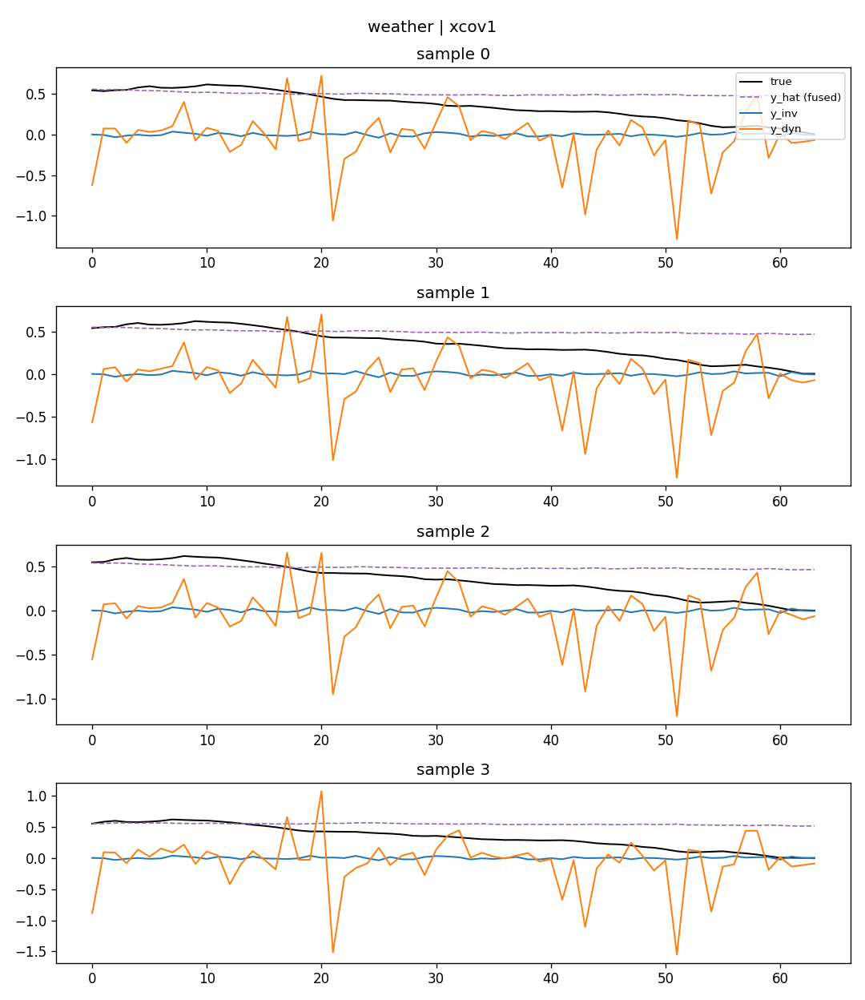
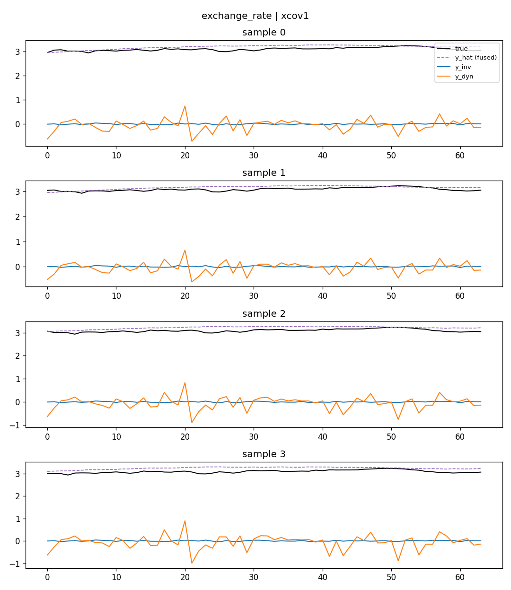

# RIDDE Training Objective ver2.0 — L_xcov 消融实验报告

日期:2026-08-13
范围:`idf_ridde_v2`(ChronosBoltRetrieve)阶段3,单独测 `L_xcov`(`rho_sem=0, rho_ord=0`),不叠加在 sem 上——因为 [RIDDE_ver2.0_sem消融实验报告.md](RIDDE_ver2.0_sem消融实验报告.md) 里 L_sem 没有被验证为有效,叠加在一个未验证有效的正则项上会让结果难以归因。
参考:`RIDDE_正则项消融实验清单.md`(阶段3 监测项 1/2/3),沿用跟 sem 阶段完全相同的实验协议(同 6 数据集、同 train_steps、同诊断脚本)。

## 1. 实验设置

- 与 sem 阶段完全一致:`train_steps=10000`,`batch_size=256`,backbone 冻结,`top_k=10`,6 个数据集(ETTh1/ETTh2/ETTm1/ETTm2/weather/exchange_rate)
- baseline 沿用 sem 报告里的 `rho_sem=rho_xcov=rho_ord=0` 结果(架构相同,纯 `L_pred`)
- 扫描点:`rho_xcov ∈ {0.01, 0.1, 1}`,单种子(2021)
- 开跑前用 100 步做了快速探测:`rho_xcov=1` 没有出现 NaN/发散,训练稳定,但观察到 gamma 饱和度在 100 步内就冲到 87%(比 sem 更快)——这个现象在完整 10000 步训练后被证实是一个更严重的问题(见第 4 节)
- 原始数据:`TS-RAG/results/ridde_v2_ablation_logs/`(train/zeroshot/diag log、`summary_xcov.txt`)、`TS-RAG/results/ridde_v2_diagnostics_npz/`、`TS-RAG/results/ridde_v2_diagnostics_plots/`

## 2. 主要结果:MSE 随 rho_xcov 的变化

| rho_xcov | ETTh1 | ETTh2 | ETTm1 | ETTm2 | weather | exchange | **6数据集平均** |
|---|---|---|---|---|---|---|---|
| 0(baseline) | 0.3517 | 0.2366 | 0.2933 | 0.1476 | 0.1479 | 0.0808 | — |
| 0.01 | -0.0% | +1.6% | +0.4% | +2.0% | +1.4% | -0.2% | **+0.84%** |
| 0.1 | +0.3% | +0.5% | -1.1% | +0.3% | +0.2% | -3.1% | **-0.47%** |
| 1.0 | +0.3% | +0.6% | -0.5% | -0.4% | -0.9% | **-10.1%** | **-1.84%** |

跟 L_sem 完全不同的是:**xcov=1 没有让训练崩掉**——不像 sem=1 那样在 ETTm1 上炸到 +146%,xcov 在三个权重下都保持数值稳定,且 rho_xcov=1 时平均 MSE 甚至比 baseline 低 1.84%,主要由 exchange_rate 的 -10.1% 拉动。更关键的是,第 3-4 节的诊断显示这个"稳定+小幅变好"背后是一个退化解,不是健康的解耦。

### 2.1 三种子方差校验(mean±std,MSE)——这次"变好"是真的

补了 2 个种子(42, 123,baseline 复用 sem 阶段已有的种子结果,因为 `rho_sem=rho_xcov=rho_ord=0` 时两边是同一个 baseline)。

| 数据集 | baseline | xcov=0.01 | xcov=0.1 | xcov=1 | Δ(0.01) | Δ(0.1) | Δ(1) |
|---|---|---|---|---|---|---|---|
| ETTh1 | 0.3516±0.0005 | 0.3519±0.0004 | 0.3528±0.0008 | 0.3523±0.0007 | +0.0002 | +0.0011 | +0.0006 |
| ETTh2 | 0.2378±0.0013 | 0.2399±0.0003 | 0.2395±0.0011 | 0.2384±0.0009 | +0.0020 | +0.0016 | +0.0006 |
| ETTm1 | 0.2918±0.0011 | 0.2931±0.0019 | 0.2919±0.0014 | 0.2915±0.0005 | +0.0013 | +0.0002 | -0.0003 |
| ETTm2 | 0.1480±0.0004 | 0.1495±0.0010 | 0.1478±0.0002 | 0.1471±0.0001 | +0.0016 | -0.0002 | **-0.0009** |
| weather | 0.1482±0.0002 | 0.1500±0.0013 | 0.1479±0.0003 | 0.1470±0.0003 | +0.0019 | -0.0003 | **-0.0011** |
| exchange_rate | 0.0800±0.0008 | 0.0846±0.0081 | 0.0790±0.0033 | 0.0734±0.0006 | +0.0046 | -0.0010 | **-0.0066** |
| **6数据集平均%变化** | — | **+1.57%** | **-0.09%** | **-1.55%** | | | |

**跟 sem 阶段不同,这次 xcov=1 在 exchange_rate 上的提升是真实、可信的**:三个种子(0.0726 / 0.0735 / 0.0740)高度一致(std=0.0006),相对 baseline 的降幅(-0.0066)是种子噪声的 11 倍,远超噪声范围。weather(-0.0011,约为噪声的 4~5 倍)和 ETTm2(-0.0009,约为噪声的 2~9 倍)也是同方向的、超出噪声的小幅改善。ETTh1/ETTh2/ETTm1 三个数据集则基本在噪声范围内,看不出方向性。

`xcov=0.01` 在 exchange_rate 上种子间波动极大(std=0.0081,单个种子 123 跑出了 0.0958 的异常值),说明这个权重下模型在该数据集上不太稳定,单看均值(+0.0046,变差)容易被这个异常种子带偏,需要留意。`xcov=0.1` 基本是中性(-0.09%),没有明显信号。

**结论:`rho_xcov=1` 对 exchange_rate(以及程度更小的 weather、ETTm2)有真实、可重复的正向效果,是三个正则项消融里目前唯一一个经过多种子验证仍然成立的正向数值结果。** 但要注意:结合第 3-4 节,这个提升的机制是"把 `z_inv` 分支基本关闭,让 `y_dyn` 独立承担预测"——一个合理的解释是,exchange_rate(汇率)这类数据的动态本身接近随机游走,检索到的"不变/共识"分量可能本来就没什么用甚至是干扰,关掉它反而让模型更专注于用 `y_dyn` 拟合残差,所以带来了准确率提升——但这不是论文原本设想的"两支都学到有意义信息、经过 xcov 解耦"的效果,更像是"xcov 意外地帮某些数据集做了一次隐式的分支剪枝"。

## 3. 监测项①:y_inv / y_dyn 可视化——看起来像目标,但是"假的"

以 weather 和 exchange_rate 为例(其余图见 `TS-RAG/results/ridde_v2_diagnostics_plots/`,文件名 `{数据集}_xcov{权重}.png`):

**xcov=1,weather:**

**xcov=1,exchange_rate:**

初看很像论文期望的样子:`y_inv`(蓝)几乎是一条平的直线,`y_dyn`(橙)带着所有的震荡——这正是你最初问的"一个平稳一个震荡"。但结合第 4 节的 gamma 数据看,**这不是学出来的语义分解,而是 `y_inv` 分支被基本"关掉"了**:

- gamma 均值只有 **0.008~0.02**(不是接近 0.5,而是几乎全员接近 0),即 `z_inv = gamma·h ≈ 0`——几乎是个零向量,跟输入样本无关。
- `inv_pred_head` 的输入长期是接近 0 的常量,它能学到的最好策略就是输出一个固定偏置——这正好表现为"一条平线",不是"学会了预测不变分量",而是"没东西可学,退化成常数"。
- 数值上也印证了这点:`R(y_dyn)-R(y_inv)` 均值高达 **5.5~6.5**(sem 阶段最高才 0.3~0.5),因为 `y_inv` 的方差趋近于 0(`R(y_inv)` 均值 -5~-6.5,几乎是常数),不是因为它学会了"平稳但有信息量的不变项"。
- **`energy_share_inv`**`= Var(y_inv) / (Var(y_inv) + Var(y_dyn))`(`y_inv` 占两支总方差的比例,50% 表示两支贡献相当,接近 0%/100% 表示某一支已经不携带有效信息)均值只有 **0.003~0.007**(sem 阶段是 0.44~0.60),`y_inv` 分支基本不携带任何有效信息。

**结论:视觉上"一平一震"的形态确实出现了,但机制是退化(某一分支被优化到接近失效),不是论文期望的"两支都携带信息、只是统计特性不同"。**

## 4. 监测项②:cos_sim(z_inv, z_dyn)——一个反直觉的结果

| 配置 | gamma 均值 | gamma 饱和比例 | \|cos_sim(z_inv,z_dyn)\| |
|---|---|---|---|
| baseline | 0.516 | 77.2% | 0.112 |
| sem=0.1(对照) | 0.518 | 77.9% | 0.114 |
| xcov=0.01 | 0.023 | 96.8% | **0.202** |
| xcov=0.1 | 0.010 | 98.3% | **0.207** |
| xcov=1 | 0.008 | 98.6% | **0.195** |

**反直觉的地方:xcov 的 gamma 饱和比例(97~99%)比 sem 更高,但 cos_sim 不仅没降低,反而比 baseline 更高(0.20 左右 vs 0.11)。**

原因跟 [sem 报告第 4 节] 里推导的公式有关,但这次饱和的*方式*不一样:

- sem/baseline 下,gamma 均值≈0.5,饱和是**双峰的**——大约一半维度饱和到 0,另一半饱和到 1,这种情况下 `Σγ(1-γ)h²` 里的项大部分都精确为 0(因为每一维要么 γ≈0 要么 γ≈1),cos_sim 因此被压低。
- xcov 下,gamma 均值≈0.01~0.02,饱和是**单向的**——几乎所有维度都饱和到 0(不是均匀分到 0 和 1),`z_inv≈0` 整体缩小,但 `z_inv` 的范数 `‖z_inv‖=‖γh‖` 按 γ 缩小的速度(线性)比 `z_inv·z_dyn=Σγ(1-γ)h²` 缩小的速度(也接近线性,因为 (1-γ)≈1)更快——结果是两者的比值(cos_sim)不降反升。

而且更本质的原因是:**`L_xcov` 度量的是"批次内的协方差"(`z_inv`、`z_dyn` 在样本间怎么一起变化),不是"单个样本内 z_inv 和 z_dyn 是否指向不同方向"(cos_sim 度量的是后者)。** 模型发现,只要让 `z_inv` 对所有样本几乎输出同一个(接近 0 的)常量,批次内的协方差自然趋于 0(因为 `z_inv` 几乎不随样本变化),这样就能"零成本"地把 `L_xcov` 训练到很小——根本不需要真正学会让两支携带不同语义信息。这是一个典型的"目标函数被钻空子"的退化解。

### 建议

这进一步印证了 sem 报告里的判断:**不建议加独立的正交正则项**,而且现在有了更强的证据——`L_xcov`(批次协方差版本)本身就存在被"退化解"钻空子的风险,如果要保留这个正则项,可能需要考虑:
- 换成直接惩罚"样本内" cos_sim 的公式(而不是批次协方差),更贴近实际想要的目标;
- 或者给 `gamma` 加一个防止整体塌缩到 0/1 一侧的约束(比如惩罚 `gamma` 的批次均值偏离 0.5 太远)。

## 5. 监测项③:gamma——问题没解决,反而更严重了

| 配置 | gamma 均值 | 饱和比例(<0.1 或 >0.9) |
|---|---|---|
| baseline | 0.516 | 77.2% |
| xcov=0.01 | 0.023 | 96.8% |
| xcov=0.1 | 0.010 | 98.3% |
| xcov=1 | 0.008 | **98.6%** |

`L_xcov` 不仅没有缓解 gamma 饱和问题,反而把它推向了一个更极端的形态——不再是"分裂成两极",而是"几乎全部塌缩到 0"(`z_inv` 分支被整体关闭)。三个权重下饱和比例都在 97~99%,权重越大越极端。

## 6. c_i 与预测质量的关系

`c_i`(检索置信度)的模式跟 sem 阶段几乎一样——ETTh2/ETTm2/exchange_rate 均值精确为 0,只有 ETTm1(≈0.12)、ETTh1(≈0.015)、weather(≈0.003)有非零值。这跟 rho_xcov 无关(`L_xcov` 本来也不使用 `c_i`),只是再次确认这是检索数据/tau 设置本身的特性,不是哪个正则项造成的。

## 7. 结论汇总

1. **数值上(已通过 3 种子校验)**:`rho_xcov ∈ {0.01, 0.1, 1}` 全部保持训练稳定(没有 sem=1 那种崩溃)。`rho_xcov=1` 在 exchange_rate 上的提升(-8.3% 平均,三种子高度一致)是可信的真实效果,weather、ETTm2 也有较小但超出噪声的改善;ETTh1/ETTh2/ETTm1 基本无变化。`rho_xcov=0.01` 在 exchange_rate 上种子间方差很大,不稳定;`rho_xcov=0.1` 基本中性。**这是三个正则项里目前唯一一个多种子验证后仍成立的正向数值结果。**
2. **可视化上(监测项①)**:`y_inv` 几乎变成一条常数直线,`y_dyn` 承担几乎所有预测方差——表面上像是实现了"一平一震",但根因是 `z_inv` 分支被 gamma 塌缩到接近 0、事实上被关闭了,不是学到了有意义的不变量表示。
3. **正交性上(监测项②)**:反直觉地,cos_sim 不降反升(0.20 vs baseline 0.11)。原因是 `L_xcov`(批次协方差形式)可以靠"让 z_inv 对所有样本输出同一个常量"来钻空子,不需要真正学会样本内的语义解耦。**进一步确认不该加独立正交正则项**,且当前 `L_xcov` 公式本身也有被钻空子的风险,如果要继续用,建议换成样本内 cos_sim 惩罚或者给 gamma 加防塌缩约束。
4. **gamma 饱和上(监测项③)**:问题没解决,反而更严重——从"双峰饱和"变成"单向塌缩到 0",饱和比例从 77% 升到 97~99%。
5. **架构层面的担忧**:`energy_share_inv` 只有 0.3~0.7%,意味着这套"不变/动态"双分支解耦架构在 `L_xcov` 下实质上退化成了单分支(`y_dyn` 独打)+ 一个基本不起作用的旁路。**数值提升(尤其 exchange_rate)很可能不是来自"学到了更好的解耦",而是"意外剪掉了一个在该数据集上没用甚至有干扰的分支"。** 如果最终目标是验证"分解成两个有意义的子表示对预测有帮助",目前的证据说明 `L_xcov` 没有帮它做到这件事;但如果单纯以准确率为目标,`rho_xcov=1` 在 exchange_rate 类数据上确实有实用价值,只是需要清楚这不是论文原本设想的机制。

## 附录:数据位置

- 训练/评估/诊断 log 与汇总表:`TS-RAG/results/ridde_v2_ablation_logs/summary_xcov.txt`(单种子+诊断)、`summary_xcov_seeds.txt`(3种子校验)及同目录下 `train_xcov*.log` / `zeroshot_xcov*.log` / `diag_xcov*.log`
- 逐样本诊断原始数组:`TS-RAG/results/ridde_v2_diagnostics_npz/*_xcov*.npz`
- y_inv/y_dyn 可视化图(18 张,3 配置 × 6 数据集):`TS-RAG/results/ridde_v2_diagnostics_plots/*_xcov*.png`
